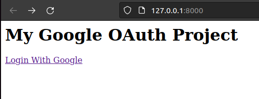

User Registration in Django using Google OAuth

Open Authorization (OAuth) is a service that allows websites or apps to share user information with other websites 
without being given a users password. Users can log in to multiple websites with the same account without creating other credentials.

To start the project, you need:

1. Install the libraries necessary for the project, to install the necessary libraries: `pip install -r requirements.txt`
2. Being in the file folder "manage.py", run the project with the command:  `python3 manage.py runserver`

